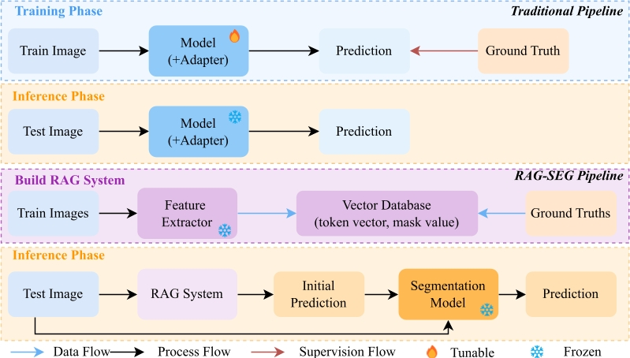
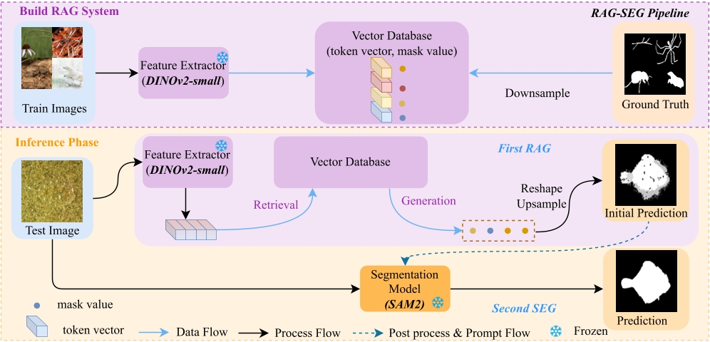

# RAG-SEG: First RAG, Second SEG
[](https://arxiv.org/abs/2508.15313)
[](https://huggingface.co/spaces/Sherry4869/RAG-SEG)

> **First RAG, Second SEG: A Training-Free Paradigm for Camouflaged Object Detection**  
> RAG-SEG leverages Retrieval-Augmented Generation (RAG) to produce pseudo prompts, followed by SAM-based segmentation.  
> On **camouflaged object detection (COD)**, RAG-SEG achieves **SOTA performance among training-free methods**, and on **salient object detection (SOD)**, it improves **inference speed**.

---

## 🚀 Highlights
- **Fast inference**: Lower GPU memory usage and faster inference than existing training-free COD methods.  
- **Generalizable**: Directly applicable to **SOD** and potentially extendable to other datasets.  

---

## ⚙️ Core Philosophy & Pipeline

### Paradigm Shift: Fine-tuning vs. RAG-SEG
Traditional methods rely on heavy architectural adapters or full-parameter fine-tuning. **RAG-SEG** shifts the complexity from *parameter learning* to *knowledge retrieval*, maintaining a lightweight and deployable footprint.


<p align="center">
  
</p>

### System Architecture
The framework consists of two distinct stages:

1.  **Stage 1: First RAG (Retrieval-Augmented Generation)**: A frozen **DINOv2** backbone extracts global and local tokens from the query image. These tokens are matched against a pre-built **FAISS** vector database to generate an initial coarse mask.
2.  **Stage 2: Second SEG (Segmentation Refinement)**: The coarse mask is processed into sparse visual prompts (key foreground/background points). These prompts guide **SAM2** to refine boundaries and produce the final high-precision segmentation.
<p align="center">
  
</p>
## 📊 Performance Benchmarks

### 1. Quantitative Evaluation on COD
RAG-SEG dominates the training-free category and rivals several supervised methods.

| Category | Method | CAMO (Sα ↑) | COD10K (Sα ↑) | NC4K (Sα ↑) |
| :------- | :----- | :----------: | :------------: | :----------: |
| **Training-based** | SINetv2 | 0.820 | 0.815 | 0.847 |
| | MDSAM | 0.852 | 0.862 | 0.875 |
| **Training-free** | SAM | 0.684 | 0.783 | 0.767 |
| | ProMaC | 0.767 | 0.805 | - |
| | **RAG-SEG (Ours)** | **0.831** | **0.854** | **0.882** |

### 2. Generalization to SOD
RAG-SEG demonstrates strong zero-shot transferability to Salient Object Detection tasks.

| Dataset | Metric | MDSAM (Training-based) | **RAG-SEG (Training-free)** |
| :------ | :----- | :--------------------: | :---------------------------: |
| **PASCAL S** | Eξ ↑ | 0.917 | **0.927** |
| **ECSSD** | Sα ↑ | 0.948 | 0.927 |
| **HKU IS** | Fβω ↑ | 0.935 | 0.918 |

## ⚙️ Installation
```bash
# Create environment
conda create -n py310 python==3.10
conda activate py310

# Install dependencies (using uv for speed)
pip install uv
uv pip install -r requirements.txt

# Run demo
python app.py
````

---

## 📊 Visualization

**Segmentation results:**

<p align="center">
  
</p>

**Demo running example:**

<p align="center">
  
</p>

For online demo, visit: [RAG-SEG HuggingFace Space](https://huggingface.co/spaces/Sherry4869/RAG-SEG)

⚠️ 建议在 本地运行 本项目，因为在 HuggingFace Space 上由于网络和 CPU 限制，推理速度可能较慢。
---

### 📱 Android Implementation Details
This APK demonstrates the on-device inference capability of the RAG-SEG paradigm.

- **Development Flow**: Built using Native Android framework via **AI-assisted coding (Vibe Coding)**.
- **Core Features**: 
  - Integrated DINOv2-small for feature extraction.
  - On-device vector search and SAM2/EdgeTAM-based refinement.
---
## 📖 Citation

If you find this work useful, please cite:

```bibtex
@article{liu2025first,
  title={First RAG, Second SEG: A Training-Free Paradigm for Camouflaged Object Detection},
  author={Liu, Wutao and Wang, YiDan and Gao, Pan},
  journal={arXiv preprint arXiv:2508.15313},
  year={2025}
}
```


## 📌 License

This project is released for **non-commercial use only**.  
For commercial licensing, please contact [wutaoliu@nuaa.edu.cn].
